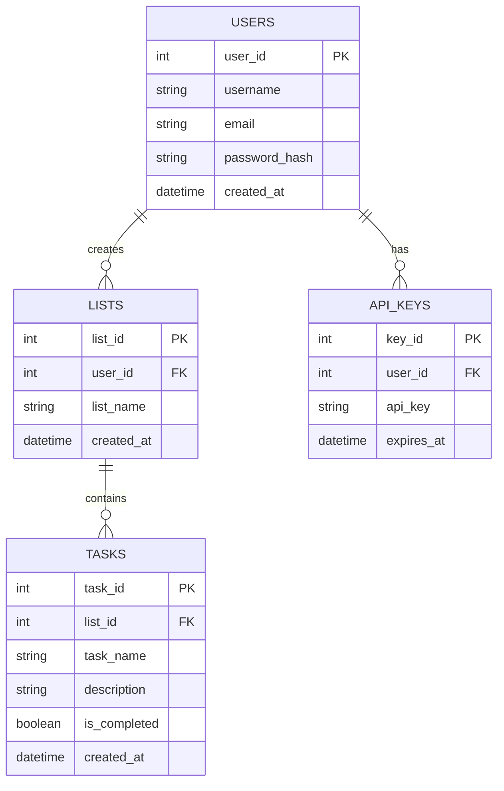

# 📝 API de Gestión de Tareas (To-Do App)


API RESTful desarrollada con FastAPI para gestionar listas de tareas personales. Implementa una arquitectura en capas (MVC) con autenticación mediante API keys.

## 🌟 Características

- ✅ Autenticación mediante API Keys
- 🔒 Operaciones CRUD protegidas
- 📝 Gestión de listas de tareas
- ✨ Documentación automática con Swagger/OpenAPI
- 🎯 Validación de datos con Pydantic
- 🏗️ Arquitectura en capas (Modelo-Vista-Controlador)
- 🔍 Búsqueda y filtrado de tareas
- 🔐 Seguridad por usuario
- 📊 Gestión eficiente de base de datos
- 🚀 Alto rendimiento y escalabilidad

## 🛠️ Tecnologías Utilizadas

- **FastAPI**: Framework web moderno y rápido
- **SQLAlchemy**: ORM para interacción con base de datos
- **Pydantic**: Validación de datos y serialización
- **PostgreSQL**: Sistema de gestión de base de datos
- **Python 3.11+**: Lenguaje de programación
- **Uvicorn**: Servidor ASGI de alto rendimiento
- **JWT**: JSON Web Tokens para autenticación
- **BCrypt**: Hashing seguro de contraseñas

## ⚙️ Requisitos Previos

- Python 3.11+
- PostgreSQL 12+
- pip (gestor de paquetes de Python)
- Git

## 📥 Instalación

1. Clonar el repositorio:
```bash
git clone <url-del-repositorio>
cd to-do-app-wom
```

2. Crear un entorno virtual:
```bash
python -m venv venv
```

3. Activar el entorno virtual:
```bash
# En Windows:
.\venv\Scripts\activate

# En macOS/Linux:
source venv/bin/activate
```

4. Instalar dependencias:
```bash
pip install -r requirements.txt
```

5. Configurar variables de entorno:
Crear un archivo `.env` en la raíz del proyecto:
```env
# Configuración de la Base de Datos
DB_HOST=tu-host-postgresql
DB_PORT=5432
DB_DATABASE=nombre-base-datos
DB_USER=usuario-db
DB_PASSWORD=contraseña-db
DB_SSL=false

# Configuración de la Aplicación
APP_NAME="To-Do App API"
APP_VERSION="1.0.0"
DEBUG=true
ENVIRONMENT=development

# Configuración de Seguridad
SECRET_KEY=tu-clave-secreta-muy-segura
API_KEY_EXPIRATION_HOURS=24
```

## 📁 Estructura del Proyecto

```
app/
├── config/
│   ├── database.py         # Configuración de la base de datos
│   └── settings.py         # Configuración general de la aplicación
├── models/
│   ├── models.py          # Modelos SQLAlchemy
│   └── schemas.py         # Esquemas Pydantic
├── repositories/
│   ├── base_repository.py # Repositorio base
│   ├── task_repository.py # Repositorio de tareas
│   ├── list_repository.py # Repositorio de listas
│   └── user_repository.py # Repositorio de usuarios
├── services/
│   ├── task_service.py    # Lógica de negocio de tareas
│   ├── list_service.py    # Lógica de negocio de listas
│   └── user_service.py    # Lógica de negocio de usuarios
├── controllers/
│   ├── task_controller.py # Controlador de tareas
│   ├── list_controller.py # Controlador de listas
│   └── user_controller.py # Controlador de usuarios
├── utils/
│   ├── auth.py           # Utilidades de autenticación
│   ├── validators.py     # Validadores personalizados
│   └── exceptions.py     # Excepciones personalizadas
└── tests/
    ├── test_tasks.py     # Pruebas para tareas
    ├── test_lists.py     # Pruebas para listas
    └── test_users.py     # Pruebas para usuarios
```

## 🔌 Endpoints de la API

### 🔐 Autenticación

| Método | Endpoint | Descripción |
|--------|----------|-------------|
| POST | `/auth/register` | Registrar nuevo usuario |
| POST | `/auth/login` | Iniciar sesión |

Ejemplo de registro:
```json
{
  "username": "john_doe",
  "email": "john@example.com",
  "password": "securepassword123"
}
```

### 📋 Listas

| Método | Endpoint | Descripción |
|--------|----------|-------------|
| GET | `/lists` | Obtener todas las listas |
| GET | `/lists/{list_id}` | Obtener lista específica |
| POST | `/lists` | Crear nueva lista |
| PUT | `/lists/{list_id}` | Actualizar lista |
| DELETE | `/lists/{list_id}` | Eliminar lista |

### ✅ Tareas

| Método | Endpoint | Descripción |
|--------|----------|-------------|
| GET | `/tasks` | Obtener todas las tareas |
| GET | `/tasks/{task_id}` | Obtener tarea específica |
| POST | `/tasks` | Crear nueva tarea |
| PUT | `/tasks/{task_id}` | Actualizar tarea |
| DELETE | `/tasks/{task_id}` | Eliminar tarea |

## 🔒 Autenticación

Todas las operaciones (excepto registro y login) requieren una API key válida en el header:
```
X-API-Key: tu-api-key
```

La API key se obtiene al registrarse o iniciar sesión y tiene una validez de 24 horas.

## 💡 Ejemplos de Uso

### 1. Registrar un usuario
```bash
curl -X POST "http://localhost:8000/auth/register" \
     -H "Content-Type: application/json" \
     -d '{
       "username": "john_doe",
       "email": "john@example.com",
       "password": "securepassword123"
     }'
```

### 2. Crear una lista
```bash
curl -X POST "http://localhost:8000/lists" \
     -H "X-API-Key: tu-api-key" \
     -H "Content-Type: application/json" \
     -d '{
       "list_name": "Compras del supermercado"
     }'
```

### 3. Crear una tarea
```bash
curl -X POST "http://localhost:8000/tasks" \
     -H "X-API-Key: tu-api-key" \
     -H "Content-Type: application/json" \
     -d '{
       "list_id": 1,
       "task_name": "Comprar leche",
       "description": "2 litros de leche deslactosada",
       "is_completed": false
     }'
```

## 📚 Documentación

La documentación detallada de la API está disponible en:
- 📘 Swagger UI: http://localhost:8000/docs
- 📗 ReDoc: http://localhost:8000/redoc

## 💾 Base de Datos

### Esquema de la Base de Datos



## 🚀 Desarrollo

### Iniciar el servidor
```bash
# Modo desarrollo con recarga automática
uvicorn main:app --reload --port 8000

# Modo producción
uvicorn main:app --host 0.0.0.0 --port 8000
```

### Ejecutar pruebas
```bash
# Ejecutar todas las pruebas
pytest

# Ejecutar pruebas con cobertura
pytest --cov=app tests/
```

## 🔐 Seguridad

- ⚡ Contraseñas hasheadas con bcrypt
- 🔑 Autenticación mediante API keys
- 👤 Validación de permisos por usuario
- 🛡️ Protección contra acceso no autorizado
- ✅ Validación de datos de entrada
- 🔒 CORS configurado
- 📝 Registro de eventos de seguridad

## 🤝 Contribuir

1. Fork el repositorio
2. Crear una rama para tu feature:
```bash
git checkout -b feature/AmazingFeature
```
3. Commit tus cambios:
```bash
git commit -m 'Add some AmazingFeature'
```
4. Push a la rama:
```bash
git push origin feature/AmazingFeature
```
5. Abrir un Pull Request

### Guía de Estilo
- Seguir PEP 8 para Python
- Documentar todas las funciones y clases
- Mantener la cobertura de pruebas > 80%
- Usar tipos estáticos cuando sea posible

## 📈 Estado del Proyecto


## 📄 Licencia

Este proyecto está bajo la Licencia MIT. Ver el archivo [`LICENSE`](LICENSE) para más detalles.

## 👥 Autores

- Daniel Morales - Desarrollador Principal

## 📞 Soporte

Si tienes alguna pregunta o sugerencia:
- 📧 Email: tu-email@example.com
- 🐛 [Reportar un bug](https://github.com/tu-usuario/to-do-app-wom/issues)
- 💡 [Solicitar una feature](https://github.com/tu-usuario/to-do-app-wom/issues) 